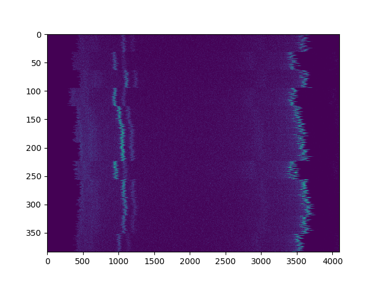
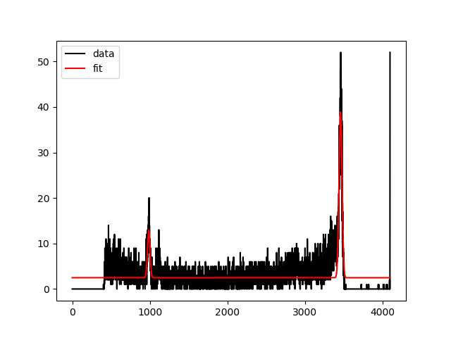
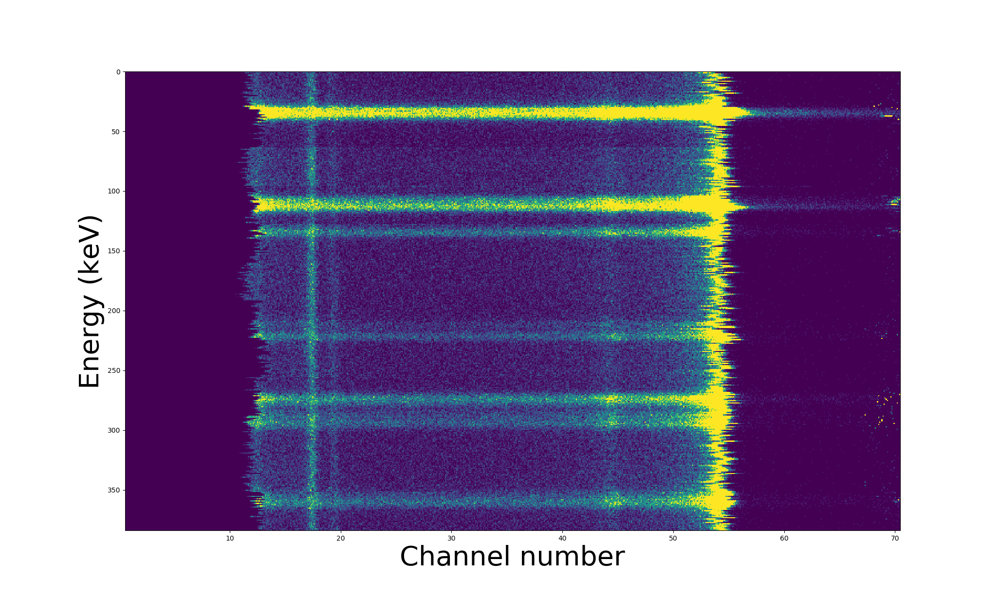
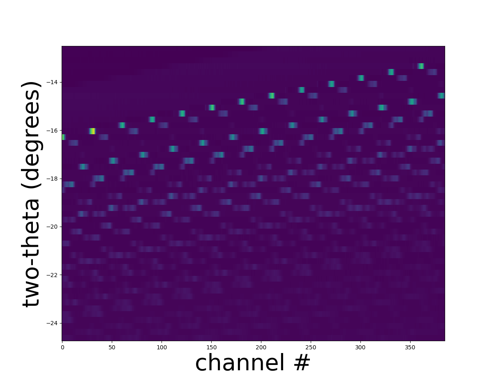
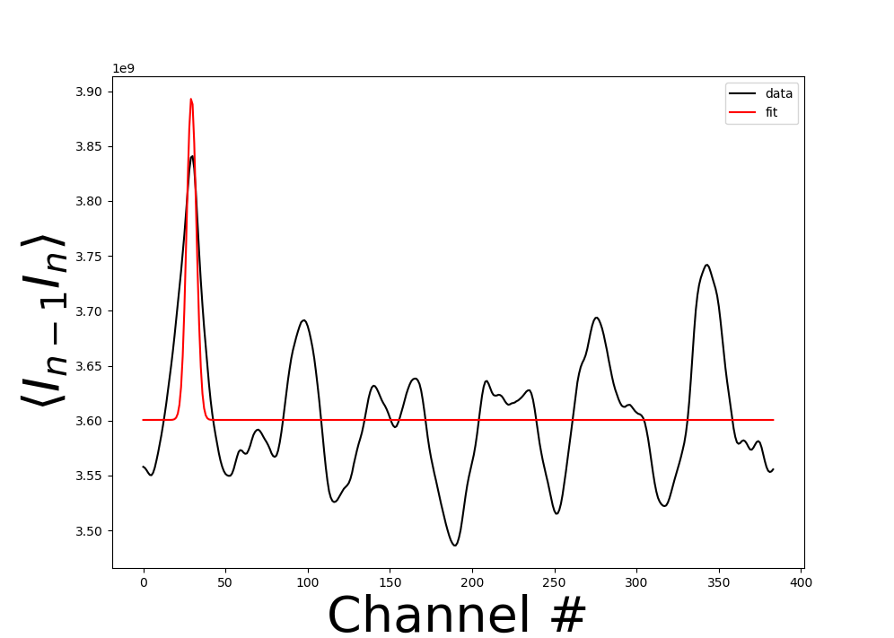
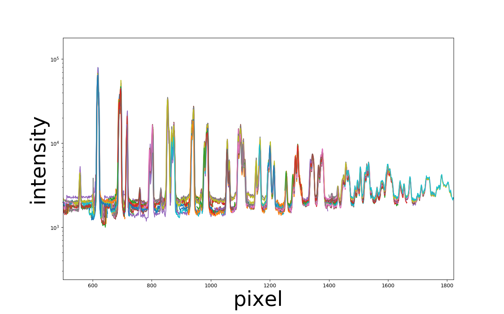

===========
Calibration
===========

Calibration for Response
------------------------

Calibrating a data set is easy.
It is assumed that you have read the documentation on :doc:`handlers
<handlers>`.

First, we need to start with some data:

.. code-block:: python

    from pygerm.reduction import germ_heat_map_uncalibrated
    # get the heatmap to calibrate
    heatmap, heatmap_centers =  \
        germ_heat_map_uncalibrated(germ_ts, germ_td, germ_pd, germ_chip,
                                   germ_chan, td_resolution=td_resolution,
                                   n_chans=n_chans, n_chips=n_chips,
                                   jump_bits=jump_bits,
                                   thresh_bits=thresh_bits,
                                   chunksize=chunksize, plot=False)

Here, ``germ_ts``, ``germ_td``, ``germ_pd``, ``germ_chip`` and ``germ_chan``
are explained in the :doc:`handlers <handlers>` documentation.

Here is a sample heatmap:

The y axis are the channel numbers and the x-axis the ADU's measured. ADU's
convert to energy with some conversion factor. The more the ADU's, the higher
the energy.

To make sense of this data, we need to convert the value of these ADU's to
energy. The formula is:

.. code-block:: python

    energy = ADUS*a + b

where ``a > 0``.

These heat maps need to be calibrated. Calibration involves measuring a known
sample with known peak positions and fitting these peak positions.

In this example, the peaks seen in the heatmap come from the molydenum k-alpha,
kbeta and Americium peak (at 60keV or so). The americium emits at 60keV and
excites the molybdenum, which then emits at the k-alpha and k-beta lines.

The specific energies of these peaks are:

* Americium : 59.5 keV
* Mo K-alpha : 17.4 keV
* Mo K-beta : 19.6 keV

For the calibration, we actually only need two peaks. We select the two highest
peaks we see: amerium (59.5keV) and Mo K-beta (19.6 keV).

Before calibrating, we need to provide a window as to where the peaks are
located. Looking at the heatmap by eye, the lower peak seems to be within
``[800,1400]`` ADU's and the higher peak between ``[3100,3900]`` ADU's. It is
important when choosing this range that the peak is present in the window **for
every channel**. 

**Peak overlap note** : It is important that you select the **two highest
peaks** as the peak finding algorithm depends on this. The peak positions are
guessed by finding the channel with the highest measured ADU's in the peak
windows given.

Finally, with all this information, we can supply it to the calibration
routine:

.. code-block:: python

    cal_vals = run_cal(heat_map,
                       energies=[17.4, 59.5],
                       peak_guesses=[[800, 1400], [3100,3900]], plot=True)

where ``energies`` are the peak energies and ``peak_guesses`` are the list of
peak windows mentioned above.

If running this with ``plot=True``, one will see a live plot of the fits, as
below:

The result, ``cal_vals`` will be a ``(2, n_channels)`` array where, for the nth
channel, the conversion is:

.. code-block:: python

    energy_n = cal_vals[n][0]*ADUS_n + cal_vals[n][1]

Finally, to obtain the calibrated heatmap, just run the calibrated version of
the heat map:

.. code-block:: python

    from pygerm.reduction import germ_heat_map

    heatmap, heatmap_centers =  germ_heat_map(germ_ts, germ_td, germ_pd, germ_chip,
                                          germ_chan, energy_resolution=.1,
                                          min_energy=0, max_energy=70,
                                          calibration = calibration,
                                          td_resolution=40e-9, n_chans=32,
                                          n_chips=12, jump_bits=29,
                                          thresh_bits=26, chunksize=1000000,
                                          plot=False)

In this case, you'll see some new parameters show up: ``energy_resolution``,
``min_energy``, ``max_energy``. These allow you to pre-select an ROI before
running the computation. In this case we set ``energy_resolution=.1`` (keV),
``min_energy=0`` and ``max_energy=70`` (keV) to select all energies we expect
the GeRM detector to have measured over.

A plot of a sample heatmap obtained is below:

This was obtained with the following code:

.. code-block:: python

    dy = heatmap_centers[0][0]-heatmap_centers[0][1]
    dx = heatmap_centers[0][1]-heatmap_centers[0][0]
    extent = [
              heatmap_centers[1][0] + dx*.5, heatmap_centers[1][-1] + dx*.5,
              heatmap_centers[0][-1] - dy*.5, heatmap_centers[0][0] + dy*.5,
    ]

    import matplotlib.pyplot as plt
    plt.figure(2);plt.clf();
    plt.imshow(heatmap, extent=extent,vmin=0, vmax=20)
    plt.xlabel("Channel number")
    plt.ylabel("Energy (keV)")

Q Calibration
-------------
The next step is q calibration. It is not clear what the two-theta range is per
channel on the detector. This depends on a multitude of factors such as
incident energy, sample to detector distance, and pixel size. The easiest way
to obtain this number is to run a calibration scan.

At the beamline, one will run a calibration scan of the sort:

.. code-block:: python

    RE(bp.rel_scan([det], tth, -1, 1, 100))

Which will result in multiple values stored. This can be retrieved as a
``pd.DataFrame`` as we did for the calibration, except with an extra column,
the name of the two-theta motor scanned. As opposed to the previous
``pd.DataFrame``, this table will contain more than one row.

.. code-block:: python

    from pygerm.reduction import get_Iq_lines

    min_energy = 30
    max_energy = 60
    h_lines = get_Iq_lines(df, min_energy, max_energy, calibration=calibration)

A sample of these ``h_lines`` is plotted here, versus two theta:

This was plotted with the following code (note most of the code prepares the
image extent):

.. code-block:: python

    tth = np.asarray(df.diff_tth_i)
    dtth = tth[1]-tth[0]
    extent = [0-.5, n_chips*n_chans+.5,
            tth[-1]-.5*dtth, tth[0]+.5*tth[-1]]

    import matplotlib.pyplot as plt
    plt.figure(2)
    plt.clf()
    plt.imshow(h_lines, extent=extent)
    plt.xlabel("channel #", size=40)
    plt.ylabel("two-theta (degrees)", size=40)

Cross-Correlations
~~~~~~~~~~~~~~~~~~

The simplest way to measure the shifts is through running cross correlations in
the data.

The last step is from this calibration data, compute the two-theta per step.
The code to do this is as follows:

.. code-block:: python

    from pygerm.calibration import compute_tth_per_step

    tth_per_step, tth_per_step_std = compute_tth_per_step(h_lines[3:],
                                                          df.diff_tth_i[3:],
                                                          plot=True)

Here, we have chosen ``h_lines[3:]`` to ignore the first three since they don't
contain peaks. We also add ``plot=True`` so see the real time plotting of the
fits.

The output for the last fit looks as follows:

For each pair of adjacent lines, we fit a cross-correlation (convolve the two
curves together) and fit the point of maximum correlation to a Gaussian. The
point of maximum correlation is where the curves have shifted.

In this case ``tth_per_step=0.0172`` with a standard deviation of
``tth_per_step_std=0.0002538``. That's about a ``1.48%`` error.  Since we
averaged 47 points and if we assume these measurements to be independent, the
mean is expected to roughly have a ``1.48/np.sqrt(47)=.21%`` error.

If we run a crude plot, by shifting versus pixel:

.. code-block:: python

    plt.figure(3);
    plt.clf()
    tth = np.asarray(df.diff_tth_i)
    tth0 = tth[0]
    chan_pos = np.arange(n_chips*n_chans)
    for tth, h_line in zip(tth, h_lines):
        step = int((tth-tth0)/tth_per_step)
        plt.semilogy(chan_pos - step, h_line)

    plt.xlim(500, 1822)
    xlabel("pixel", size=40)
    ylabel("intensity", size=40)

We see the following:

Alternatives
~~~~~~~~~~~~

It may be possible to have this calibration working using a Hough transform
(suggested by Thomas Caswell; see in scikit-image). This could be investigated
in the future.
