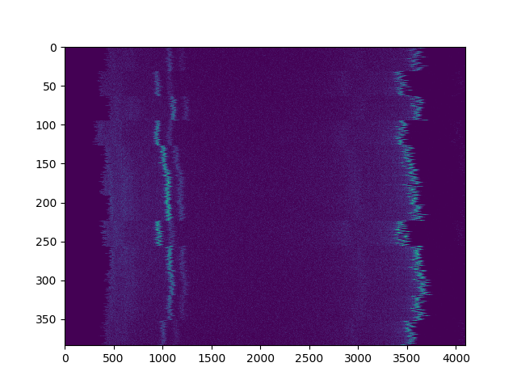

===========
Calibration
===========

Calibrating a data set is easy.

First, we need to start with some data:

.. code-block:: python

Start with a heatmap.

.. code-block:: python

    cal_vals = run_cal(heat_map,
                       energies=[17.4, 59.5],
                       peak_guesses=[[800, 1400],
                                     [3100,3900]])

Here, ``heat_map`` is a 2d array of energy x channel.  For the calibration, we
need two peaks that are far enough apart, whose energies are known. In this
case, the peaks are at 17.4keV and 59.5keV.  Finally, we need some guesses as
to where these peaks are located. We just need the window to be good enough to
locate the approximate peak position by locating the index where the max
position is.
