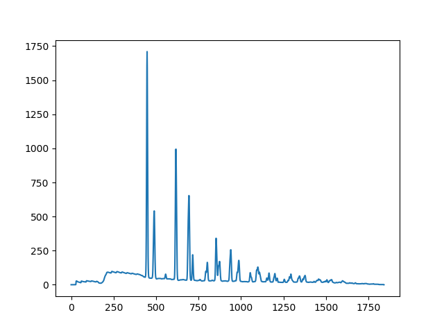

=========
Stitching
=========

After calibrating, it is possible to stitch the image.

The stitching routine is as follows:

.. code-block:: python

    line, pos, count = stitch(line1, pos1, counts1, line2, pos2, counts2, dpos=1)

where ``line1``, ``pos1``, ``counts1`` are the line, x positions (pixel
positions) and the counts (just array of ones) for the first line, and the same
for the second line. This routine is written in this fashion so as to be
stateless (i.e. can be streamed).

It is easily done as:

.. code-block:: python

    from pygerm.stitching import stitch

    h_stitched = h_lines[0]
    pos_stitched = chan_pos
    counts_stitched = np.ones_like(h_stitched)

    tth0 = tth[0]

    counts_orig = np.ones_like(h_lines[0])
    for tth_i, h_line in zip(tth[1:], h_lines[1:]):
        step = ((tth_i-tth0)/tth_per_step)
        h_stitched, counts_stitched, pos_stitched = \
            stitch(h_line, chan_pos-step, counts_orig,
               h_stitched, counts_stitched, counts_stitched)

Results in:

