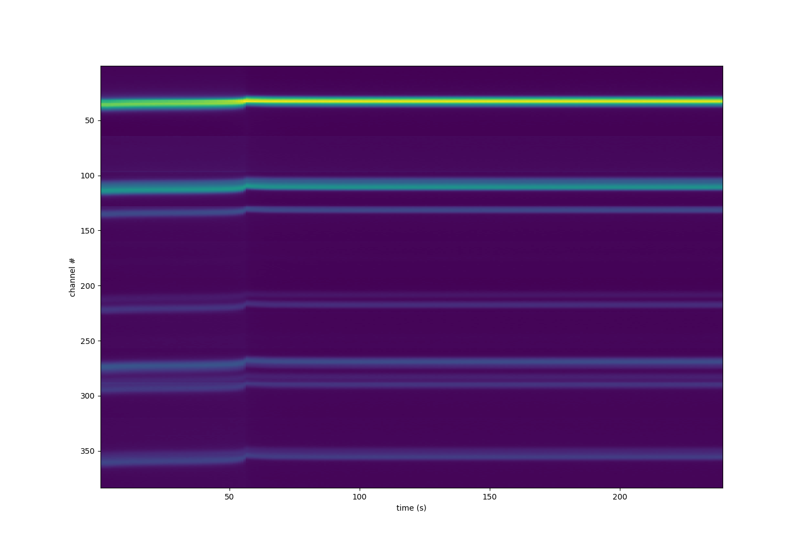

================
Time Series Data
================

One interesting run is to watch a sample undergo some transformation, such as a
phase transition. Since GeRM provides energy resolved measurements, this can
lead to a 3D data set of (q space, energy, time).

The data is acquired by simply starting the GeRM detector and having it write
ot a binary blob.

It is assumed that you have read the :doc:`calibration <calibration>` step.

The first step to analyzing the time series data is to know what ranges to bin
on. For example, we need to know the time range. To obtain it:

.. code-block:: python

    from pygerm.reduction import get_time_range
    ti, tf = get_time_range(germ_ts)

In this case, ``tf-ti`` will provide you the time range of your data set. The
function that obtains this time range is not very straightforward. One main
reason is that the registers that record the timestamp (at 40ns resolution) of
the data overflow. At the time of this writing, this overflow typically occurs
near 21s or so (29 bits reserved for 40ns clock cycles). We need to go through
the full data set and catch these overflows to properly judge how long a data
set took.

The data can be read back in by the following function:

.. code-block:: python

    from pygerm.reduction import histogram_germ

    h_vals, h_centers =  histogram_germ(germ_ts, germ_td,
                                        germ_pd, germ_chip, germ_chan,
                                        time_resolution=1, start_time=0,
                                        end_time=240, energy_resolution=30,
                                        min_energy=30, max_energy=60,
                                        calibration=calibration,
                                        td_resolution=40e-9, n_chans=32,
                                        n_chips=12, jump_bits=29, thresh_bits=26,
                                        chunksize=1000000, plot=True)

